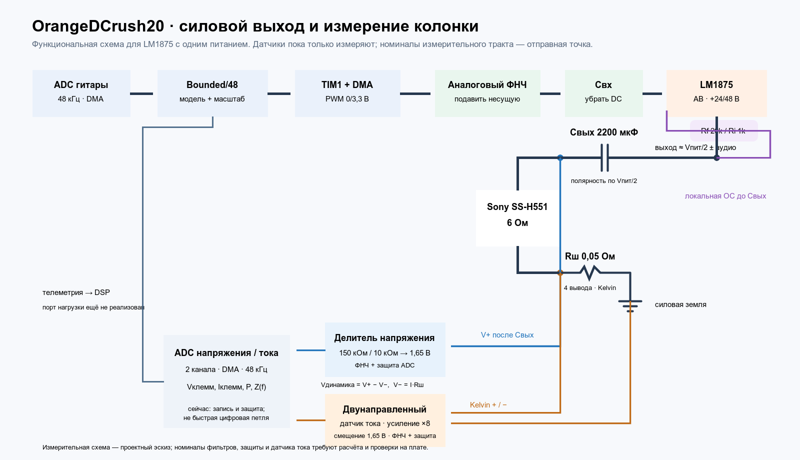

# Обратная связь силового выхода

> Статус 2026-10-06: это проект телеметрии, датчик ещё не идентифицирован,
> реальный цифровой порт не реализован. [Порядок первого звука](HARDWARE_NEXT.md).



Редактируемый источник рисунка — `docs/images/audio_output_feedback.svg`.
Запускаемая схема с идеализированными датчиками —
`simulation/experiments/audio_output/lm1875_single_supply.cir`.

## Две разные петли

**Аналоговая петля LM1875** замкнута резисторами усилителя с его выхода до
разделительного конденсатора на инвертирующий вход. В нашей SPICE-топологии
`Rf=20 кОм`, `Ri=1 кОм` и последовательный `Cfb=22 мкФ`, поэтому усиление
по переменному сигналу около 21. Она поддерживает линейную работу самого
оконечника и не ждёт ADC/DMA. Реальная обвязка и монтаж должны сверяться с
[однополярным применением TI](https://www.ti.com/lit/ds/symlink/lm1875.pdf).
Выходной конденсатор и колонка находятся **вне** этой локальной петли.

**Клеммная телеметрия** измеряет напряжение и ток уже на Sony. На первом
этапе она нужна для проверки размаха, ограничения, тепла/мощности и
электрического поведения колонки, а не для быстрой поправки PWM. Нынешний
`BoundedState::step(input)` принимает только входной отсчёт, рассчитывает
нагрузку как фиксированные 6,5 Ом и не имеет порта реальных `v/i`.
Прямое включение измерений в Newton изменило бы физическую модель и
потребовало бы проверки причинности, задержки, устойчивости, точности и
оконного времени. 64 отсчёта при 48 кГц — 1,333 мс: блочный цифровой
контур нельзя считать заменой локальной аналоговой обратной связи.

## Где снимать напряжение

`V+` — узел **после** выходного конденсатора, у плюсовой клеммы колонки;
`V−` — обратная клемма колонки перед шунтом. Напряжение динамика
`Vдинамика = V+ − V−`. Для пробного делителя `150 кОм` от V+ к ADC и
`10 кОм` от ADC к опоре 1,65 В:

```text
Vadc = (V+ + 15·Vref)/16
V+   = 16·Vadc − 15·Vref
```

Если V+ меняется в пределах ±24 В при Vref=1,65 В, идеальный выход делителя
будет от 0,047 до 3,047 В. Это мало оставляет до нижней шины при выбросах,
поэтому нужны ограничение входного тока, защита ADC, фильтр перед выборкой и
проверка пуска/отключения. Сопротивление источника у делителя около 9,4 кОм:
длительность выборки ADC или буфер следует выбрать по [характеристикам
STM32H7R3](https://www.st.com/resource/en/datasheet/stm32h7r3a8.pdf), а
не считать эти номиналы готовым входом ADC.

## Где снимать ток

Пробный шунт `Rш=0,05 Ом` ставится последовательно **в обратный провод
колонки**, между её минусовой клеммой и силовой землёй. К нему идут отдельные
Kelvin-провода; другой путь возврата тока динамика обошёл бы шунт и сломал
измерение. `Iдинамика = Vш/Rш`. Для 20 Вт синусом на 6 Ом это 1,83 А RMS,
2,58 А пик, около 0,13 В пик на шунте и 0,17 Вт среднего тепла. Для
прототипа разумный ориентир — малоиндуктивный четырёхвыводный шунт с запасом
по мощности, например 2 Вт; фактические пики и нагрев проверить отдельно.

Идеальный датчик в SPICE даёт `Iadc = 1,65 В + 8·Vш`: при ±2,58 А выходит
приблизительно 0,62…2,68 В. Реальный измерительный усилитель пока не выбран.
Ток в звуковой катушке двунаправленный: напряжение на шунте уходит и ниже
земли, поэтому обычный ОУ с входным диапазоном от нуля может не подойти.
Нужна схема с допустимым отрицательным входным синфазным напряжением либо
корректно смещённым дифференциальным входом; см. [рекомендации TI по
двунаправленному низкостороннему измерению](https://www.ti.com/tool/CIRCUIT060033).
Отдельно нужны фильтрация и защита ADC. Два канала измерения должны иметь
согласованные задержки: иначе фазу `V/I` и импеданс колонки можно исказить.

## Какая нужна полоса и годится ли INA226

Если цель — только контроль напряжения, тока и средней мощности блока питания и
медленная защита, достаточно десятков или сотен обновлений в секунду.
Для этой роли модуль **INA226 подходит на шине 24 В**, если проверить
номинал его шунта и токовый диапазон. Можно поставить его перед повышайкой
и следить за входной мощностью. На шину **48 В** его подключать нельзя:
[даташит TI INA226](https://www.ti.com/lit/ds/symlink/ina226.pdf) задаёт
измерение шины 0…36 В и отдельно предупреждает не подавать выше 36 В.
Ток питания оконечника не равен мгновенному току через колонку.

Для формы `Vдинамика(t), Iдинамика(t)` и оценки фазового импеданса INA226
не годится. Самое короткое преобразование длится 140 мкс на шунте и 140 мкс
на шине, то есть при измерении обоих обновление происходит не чаще примерно
каждые 280 мкс — **около 3,57 тыс. пар/с**, до дополнительных усреднения
и чтения I²C. Даже измерение одного шунта даёт не более 7,14 тыс. отсчётов/с,
тогда как наш звук идёт на 48 тыс. отсчётов/с. Кроме того, вход шунта INA226
рассчитан на ±81,92 мВ: пробный шунт 50 мОм дал бы ±129 мВ при 20 Вт/6 Ом.
На клеммах после выходного конденсатора напряжение двуполярное, а вход VBUS
INA226 работает от 0 В, так что модуль не подключается туда как пара
звуковых `V/I` датчиков.

Для первого измерения колонки предлагаем полезную звуковую полосу хотя бы
**20 Гц…10 кГц** при 48-кГц выборке. Аналоговые датчики должны быть заметно
шире этой полосы (ориентир от 100 кГц для малых собственных фазовых ошибок),
а оба ADC-канала должны получить согласованные противоналожительные фильтры
и известную взаимную задержку. Это проектный ориентир, не готовые номиналы
фильтра. Если потребуется точная фаза до 20 кГц, у 48-кГц выборки слишком
узкий переход к частоте Найквиста 24 кГц: придётся отдельно проработать
более высокую частоту измерения и фильтрацию, сохранив DSP на 48 кГц.

Конкретный кандидат для звукового тока — [INA240A1](https://www.ti.com/lit/ds/symlink/ina240.pdf):
аналоговый выход, усиление ×20, полоса 400 кГц, входной синфазный диапазон
от −4 В и настройка нуля в середину питания. С шунтом **20 мОм** его
масштаб `20·0,02 = 0,4 В/А` совпадает с нынешней идеальной моделью
`8·0,05 = 0,4 В/А`, при этом потери на шунте меньше. Это кандидат для
проверки, а не выбранная деталь: нужны расчёт диапазона выхода, выбор
корпуса, защита, фильтр, фазовая калибровка и проверка разводки Kelvin.

Пользователь предложил уже имеющийся датчик **ACS720 «на 5 А»** вместо
поиска INA240. В [официальном даташите Allegro ACS720](https://www.allegromicro.com/-/media/files/datasheets/acs720-datasheet.pdf)
нет исполнения ±5 А: варианты — ±15, ±35, ±65 и ±80 А. Ближайший ACS720
`-15AB` имеет чувствительность 90 мВ/А, выход 1,5 В при нуле, аналоговую
полосу 120 кГц, типичную задержку отклика 4 мкс и требует 5 В питания.
При расчётных ±2,58 А он выдаст примерно 1,27…1,73 В, так что ADC 3,3 В
может считывать полезный сигнал без дополнительного масштабирования.
Встроенный проводник около 1 мОм почти не меняет нагрузку. Его можно
поставить **после выходного конденсатора последовательно с плюсовым проводом
динамика**, оставив минус колонки прямо на силовой земле. Тогда делитель
напряжения снимает плюс **после датчика**, и `Vдинамика=V+` без поправки на
низкосторонний шунт.

Это удобнее для первого звукового опыта, но хуже по отношению сигнал/шум на
малых токах, чем более чувствительный шунтовый тракт: Allegro указывает
типичный входной шум 31 мА RMS при полосе 20 кГц с указанной фильтрацией.
Кроме того, верхнее значение ограничения выхода датчика — 3,5 В, выше
питания ADC 3,3 В; защиту входа и пусковые переходные процессы нужно
предусмотреть даже при номинальном сигнале 0…3 В. Фильтр вывода `FILTER`
и общий антиалиас-фильтр выбирать совместно с измерительной полосой,
чтобы фазовые задержки каналов можно было откалибровать.

Маркировку следует сверить перед схемой платы: [ACS712-05B](https://www.allegromicro.com/-/media/files/datasheets/acs712-datasheet.pdf)
действительно существует на ±5 А, но это **другая** микросхема с нулём
около 2,5 В, чувствительностью 185 мВ/А и полосой 80 кГц. При полном
+5-А токе её выход превысит 3,3 В, поэтому её нельзя подключать к ADC
по схеме, рассчитанной для ACS720.

## Проверка модели и следующий аппаратный этап

После добавления шунта и идеальных датчиков ngspice при 24 В и входном
синусе 0,35 В пик дал 5,146 В RMS на 6 Ом, `Vadc=1,088…2,006 В` и
`Iadc=1,165…2,135 В`. При 48 В и входе 0,7 В пик получилось 10,302 В RMS,
`Vadc=0,629…2,465 В` и `Iadc=0,679…2,622 В`. Это проверка проводов и
масштаба в **поведенческой** модели, не предсказание параметров LM1875.

На плате сначала проверить аналоговый выход, локальную устойчивость LM1875
и выбранный токовый тракт на резистивной нагрузке. Потом калибровать оба ADC-тракта и записать
совместные `V+` и `I` на 48 кГц с меткой времени. Для низкостороннего шунта восстановить
`Vдинамика=V+−I·Rш`; при датчике Холла в плюсовом проводе и возврате
колонки прямо на землю измерять `Vдинамика=V+` после датчика. Среднюю
активную мощность считать средним `Vдинамика·I`, а импеданс
оценивать по амплитуде и фазе частотных компонент, не по мгновенному `V/I`
около переходов через ноль. После этого сравнить реальную нагрузку с
фиксированными 6,5 Ом модели и отдельно решать, нужен ли цифровой контур.
